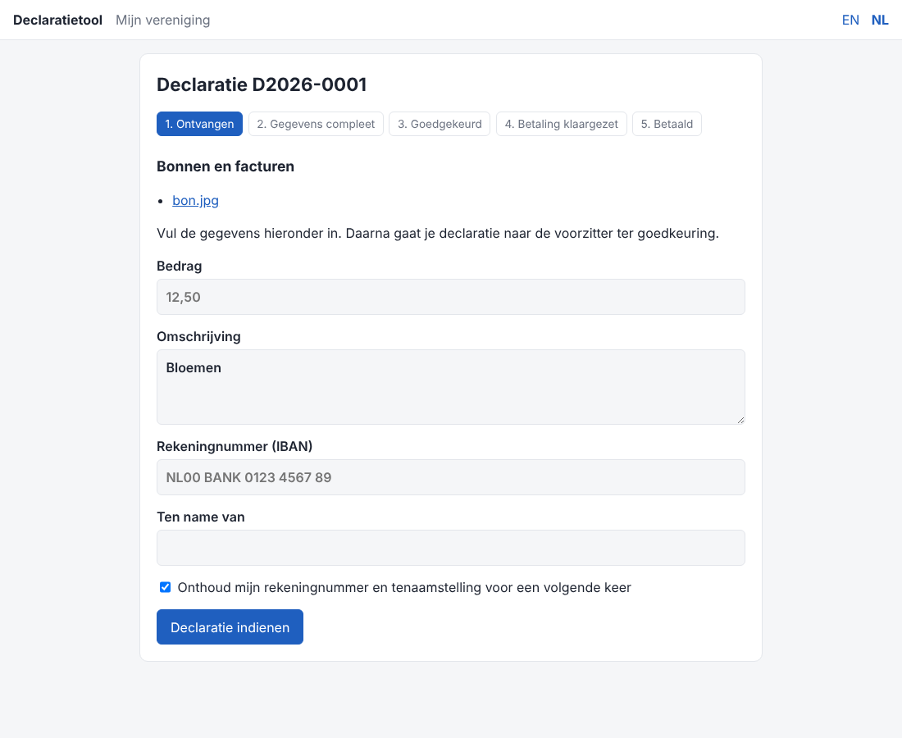
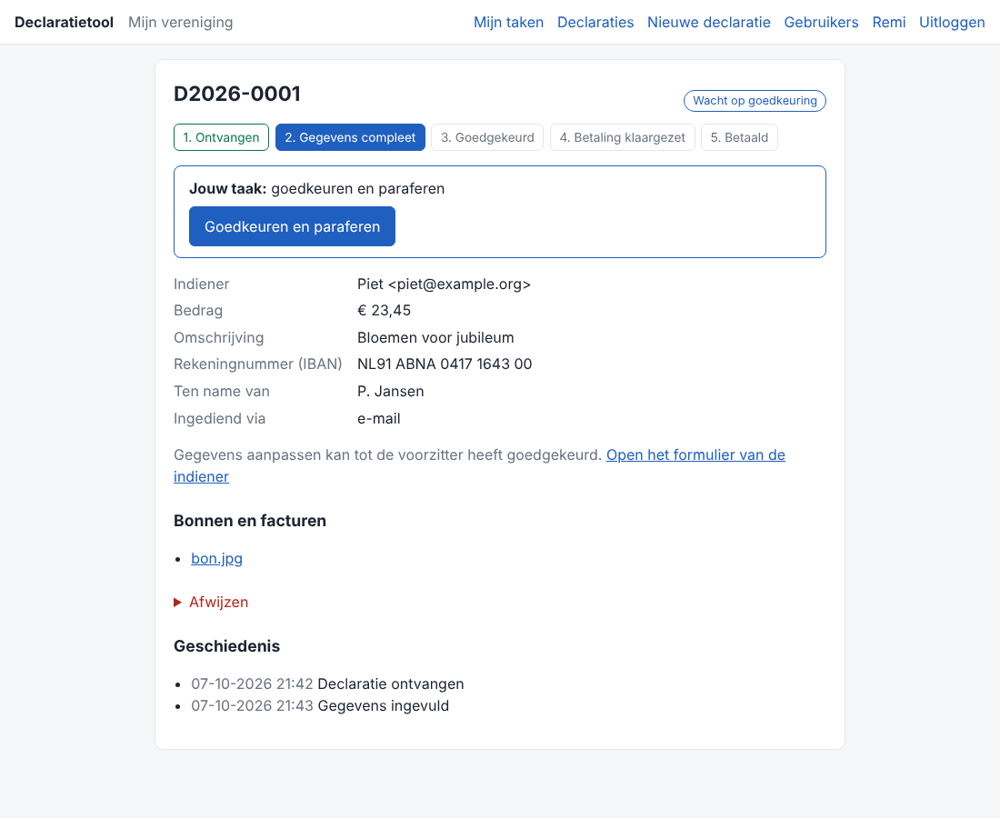
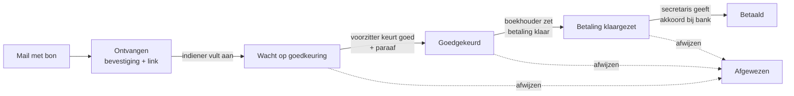

# Declaratietool

Een kleine, zelf te hosten webapplicatie om declaraties van een vereniging of stichting af te handelen: van een gemailde foto van een bon tot en met de betaling.

- **Indienen per mail.** Iemand mailt een foto of pdf van de bon naar één vast adres en krijgt direct een bevestiging met een persoonlijke link.
- **Aanvullen via een link.** Via die link vult de indiener bedrag, omschrijving, IBAN en tenaamstelling in. Rekeninggegevens worden onthouden voor een volgende keer (en blijven aan te passen).
- **Goedkeuren met paraaf.** De voorzitter krijgt een mail, keurt goed in het portaal en de bonnen krijgen automatisch een paraaf (stempel met naam, datum en kenmerk) als pdf.
- **Betalen.** De boekhouder krijgt een mail met alle gegevens en de geparafeerde bonnen en zet de betaling klaar bij de bank. Daarna krijgt de secretaris bericht om de betaling akkoord te geven.
- **Altijd op de hoogte.** De indiener krijgt bij elke stap een update. Wie nog een taak open heeft, krijgt elke dag een herinnering.
- **Portaal.** Voorzitter, boekhouder en secretaris loggen in om de status van alle declaraties te zien en kunnen zelf een declaratie aanmaken namens iemand.
- **Meertalig.** Nederlands en Engels; een taal toevoegen is één bestand vertalen.
- **Docker.** Draait met `docker compose` op een eigen server, met automatisch https voor je eigen domein. Bijwerken via GitHub.

| Indiener vult gegevens aan | Voorzitter keurt goed |
| --- | --- |
|  |  |

## Hoe het werkt



Meer uitleg per rol staat in [docs/gebruik.md](docs/gebruik.md).

## Snel starten

Je hebt nodig: een server met Docker, een domeinnaam en een mailbox (IMAP + SMTP) voor de declaraties.

```bash
git clone https://github.com/<jouw-naam>/declaratietool.git
cd declaratietool
cp .env.example .env        # vul domein, wachtwoorden en mailgegevens in
docker compose up -d --build
docker compose exec app python -m app.cli create-user \
    --email jij@example.org --name "Jouw naam" --roles admin,treasurer
```

Open daarna `https://<jouw-domein>` en log in. Voeg via **Gebruikers** de voorzitter en secretaris toe.

Bijwerken naar de nieuwste versie:

```bash
git pull && docker compose up -d --build
```

## Documentatie

- [Stappenplan](docs/stappenplan.md): van nul tot werkende tool, inclusief domein en mail
- [Installeren op een VPS bij OVH](docs/ovh-vps.md): stap voor stap, met installatiescript
- [Installatie en bijwerken](docs/installatie.md)
- [Installeren met Portainer](docs/portainer.md) (met je eigen reverse proxy)
- [Configuratie](docs/configuratie.md): alle instellingen in `.env`
- [Beveiliging](docs/beveiliging.md): wat de tool zelf doet en hoe je de server dichtzet
- [Gebruik](docs/gebruik.md): wat elke rol doet
- [Ontwikkelen](docs/ontwikkeling.md): lokaal draaien, tests, een taal toevoegen

## Techniek

Python 3.13, FastAPI, SQLAlchemy + Alembic, PostgreSQL, Jinja2, Caddy. Geen JavaScript-framework; de pagina's werken ook prima op een telefoon.

## Licentie

[MIT](LICENSE)
